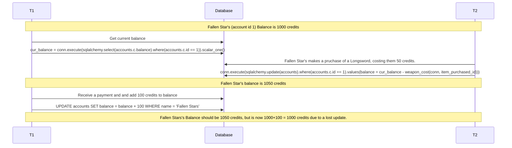
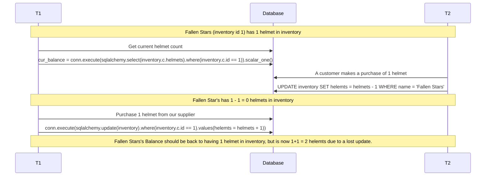

# Concurrency Cases

## Case 1: Credits
The first case we could potentially encounter is a lost update with our store's credit total. If we did not have concurrency control protection then what could occur is we could want to take a look at our current balance and then make a purchase of a Longsword, thus deducting 50 credits from our account. However, if a customer were to make a purchase and give us credits after we found our current balance but before we updated the balance with our own purchase, then the reduced balance would be lost. Instead we use a ledgerized system where we monitor the change in credits for the shop. This way there are no updates that can overwrite each other because we make unique insert statements for each transaction, and we can sum the "change" column at any point to see how many credits we have. 

## Case 2: Items
We could encounter another case of a lost update with our store's item inventory totals. Let's look at a specific example. If we did not have concurrency control protection then what could occur is we could want to take a look at our current total of helmets and then make a sale of a helmet to a customer, thus deducting 1 helmet from our inventory. However, if we were to make a purchase and add a helmet to our inventory after we found our current number of helmets but before we updated the helmet count with the customer's purchase, then the reduced helmet count from the shop's purchase would be lost. Instead we use a ledgerized system where we monitor the change in items for the shop. This way there are no updates that can overwrite each other because we make unique insert statements for each transaction, and we can sum the "qty_change" column at any point to see how many of a specifc item we have. 

## Case 3: Mods
