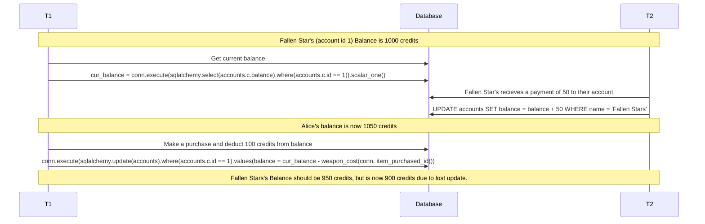

# Concurrency Cases

## Case 1: Credits

```mermaid
sequenceDiagram
    participant T1
    participant Database
    participant T2
    Note over T1, T2: Fallen Star's (account id 1) Balance is 1000 credits
    T1->>Database: Get current balance
    T1->>Database: cur_balance = conn.execute(sqlalchemy.select(accounts.c.balance).where(accounts.c.id == 1)).scalar_one();
    T2->>Database: Fallen Star's recieves a payment of 50 to their account.
    T2->>Database: UPDATE accounts SET balance = balance + 50 WHERE name = 'Fallen Stars'
    Note over T1, T2: Alice's balance is now 1050 credits
    T1->>Database: Make a purchase and deduct 100 credits from balance
    T1->>Database: conn.execute(sqlalchemy.update(accounts).where(accounts.c.id == 1).values(balance = cur_balance - weapon_cost(conn, item_purchased_id)))
    Note over T1, T2: Fallen Stars's Balance should be 950 credits, but is now 900 credits due to lost update.
```
## Case 2: Items

## Case 3: Mods
